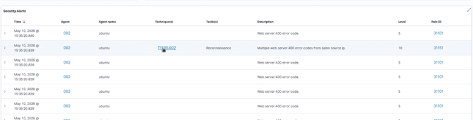
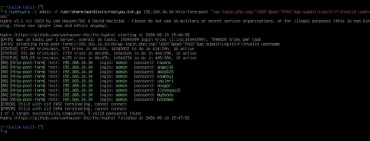
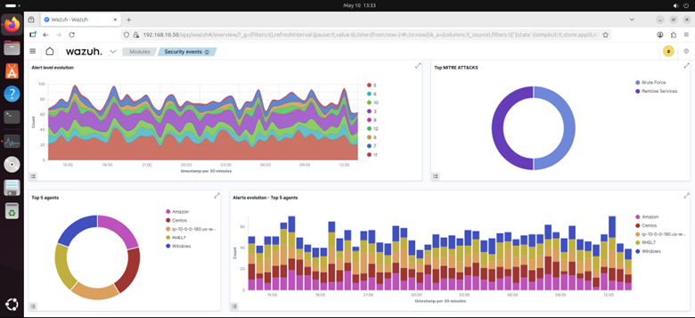
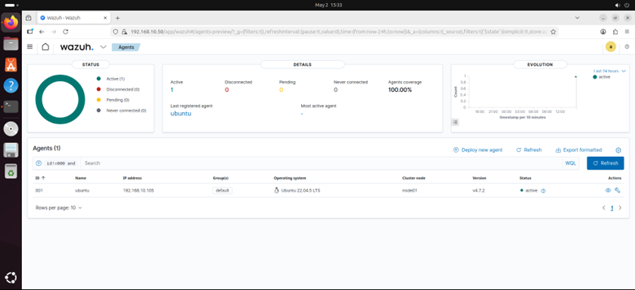

# Wazuh SIEM Security Monitoring Lab

A hands-on cybersecurity lab for deploying **Wazuh SIEM** to monitor endpoints, collect security logs, and detect simulated web-based attacks in a controlled network environment.

The project integrates **Wazuh, pfSense, Ubuntu, Apache, WordPress, Kali Linux, Nikto, and Hydra** to demonstrate a practical Security Operations Center (SOC) monitoring workflow.

---

## Project Overview

This project focuses on building and testing a Wazuh-based security monitoring environment.

The lab was designed to:

- Deploy a Wazuh SIEM platform
- Monitor Linux endpoints using Wazuh Agent
- Collect and analyze security-related logs
- Integrate a web server running Apache and WordPress
- Use pfSense as the network security gateway
- Simulate common web attacks from Kali Linux
- Verify that Wazuh can detect suspicious activities
- Analyze generated alerts through the Wazuh Dashboard
# Wazuh SIEM Security Monitoring Lab

A hands-on cybersecurity lab for deploying **Wazuh SIEM** to monitor endpoints, collect security logs, and detect simulated web-based attacks in a controlled network environment.

The project integrates **Wazuh, pfSense, Ubuntu, Apache, WordPress, Kali Linux, Nikto, and Hydra** to demonstrate a practical Security Operations Center (SOC) monitoring workflow.

---

## Project Overview

This project focuses on building and testing a Wazuh-based security monitoring environment.

The lab was designed to:

* Deploy a Wazuh SIEM platform
* Monitor Linux endpoints using Wazuh Agent
* Collect and analyze security-related logs
* Integrate a web server running Apache and WordPress
* Use pfSense as the network security gateway
* Simulate common web attacks from Kali Linux
* Verify that Wazuh can detect suspicious activities
* Analyze generated alerts through the Wazuh Dashboard

The project was implemented in a controlled laboratory environment using virtual machines.

---

## Architecture

```text
                         ┌──────────────────────┐
                         │      Kali Linux      │
                         │   Attack Simulation  │
                         │  Nikto / Hydra       │
                         └──────────┬───────────┘
                                    │
                                    │
                              ┌─────▼─────┐
                              │  pfSense  │
                              │ Firewall  │
                              └─────┬─────┘
                                    │
                         ┌──────────┴──────────┐
                         │                     │
                  ┌──────▼──────┐       ┌──────▼─────────┐
                  │ Web Server  │       │ Wazuh Manager  │
                  │ Ubuntu      │       │ Ubuntu         │
                  │ Apache      │       │                │
                  │ WordPress   │       │ Manager        │
                  │ Wazuh Agent │──────►│ Indexer        │
                  └─────────────┘ Logs  │ Dashboard      │
                                        └─────────────────┘
```

### Main Components

| Component         | Role                                           |
| ----------------- | ---------------------------------------------- |
| Wazuh Manager     | Security event processing and alert generation |
| Wazuh Indexer     | Security event storage and indexing            |
| Wazuh Dashboard   | Security monitoring and visualization          |
| Wazuh Agent       | Endpoint log collection                        |
| pfSense           | Firewall and network gateway                   |
| Ubuntu Web Server | Apache/WordPress monitored endpoint            |
| Kali Linux        | Attack simulation                              |
| Nikto             | Web vulnerability scanning                     |
| Hydra             | Brute-force attack simulation                  |

---

## Lab Environment

| System         | Platform    | Purpose                                |
| -------------- | ----------- | -------------------------------------- |
| Wazuh Manager  | Ubuntu      | SIEM server                            |
| Web Server     | Ubuntu      | Apache / WordPress / Wazuh Agent       |
| Kali Linux     | Linux       | Attack simulation                      |
| pfSense        | Firewall OS | Network security gateway               |
| Windows Client | Windows     | Endpoint in the laboratory environment |

The project report defines the laboratory network using separate WAN, LAN, and DMZ segments. The Web Server and Wazuh Manager are deployed as separate virtual machines in the environment.

---

## Technologies

* **Wazuh**
* **Wazuh Agent**
* **Wazuh Manager**
* **Wazuh Indexer**
* **Wazuh Dashboard**
* **pfSense**
* **Ubuntu Linux**
* **Apache2**
* **WordPress**
* **Kali Linux**
* **Nikto**
* **THC Hydra**
* **VMware**

---

## Deployment

### 1. Wazuh Manager

The Wazuh platform was deployed using the Wazuh installation process and includes:

* Wazuh Manager
* Wazuh Indexer
* Wazuh Dashboard

The Manager acts as the central security monitoring component responsible for receiving and processing events from monitored endpoints.

---

### 2. Wazuh Agent

A Wazuh Agent was installed on the Ubuntu Web Server.

The agent connects to the Wazuh Manager and forwards relevant endpoint events for centralized monitoring.

After installation, the agent was verified through the Wazuh Dashboard and confirmed as active.

---

### 3. Web Server

The monitored endpoint runs:

```text
Ubuntu
 ├── Apache2
 ├── PHP
 ├── MySQL
 ├── WordPress
 └── Wazuh Agent
```

Apache and WordPress provide the web application environment used during attack simulation.

---

### 4. pfSense

pfSense is used as the network security gateway between the laboratory network segments.

The laboratory architecture separates traffic into:

```text
WAN
 │
 └── pfSense
      ├── LAN
      └── DMZ
```

This allows the attack and monitoring scenarios to be tested within a controlled network environment.

---

## Security Monitoring

The monitoring workflow can be summarized as:

```text
Endpoint
   │
   │ Security / System Logs
   ▼
Wazuh Agent
   │
   │ Events
   ▼
Wazuh Manager
   │
   ├── Rule Matching
   ├── Alert Generation
   │
   ▼
Wazuh Indexer
   │
   ▼
Wazuh Dashboard
```

The dashboard provides centralized visibility into generated security alerts and endpoint activity.

---

# Attack Simulation

Two main attack scenarios were tested against the monitored web server.

---

## Scenario 1 — Web Vulnerability Scanning

### Tool

**Nikto**

Nikto was used to perform web server vulnerability and configuration scanning against the target web server.

### Detection

During the scan, Wazuh detected abnormal repeated HTTP GET requests generated by the scanning activity.

The report records:

```text
Rule ID:    31101
Alert Level: 5/10
Activity:   Repeated abnormal HTTP GET requests
```

This demonstrates how web scanning activity can generate detectable events within the SIEM environment.

### Evidence



---

## Scenario 2 — WordPress Brute-Force Attack

### Tool

**THC Hydra**

Hydra was used to simulate repeated login attempts against the WordPress login endpoint:

```text
/wp-login.php
```

### Detection

Wazuh detected repeated HTTP POST requests associated with the brute-force activity.

The report records:

```text
Rule ID:    40501
Alert Level: 10/10
Activity:   Repeated HTTP POST requests
```

This scenario demonstrates the ability of Wazuh to generate a high-level alert when repeated suspicious authentication-related web requests are observed.

### Evidence



---

# Detection Results

| Attack Scenario            | Tool  | Wazuh Rule | Alert Level | Detection |
| -------------------------- | ----- | ---------: | ----------: | --------- |
| Web vulnerability scanning | Nikto |      31101 |        5/10 | Detected  |
| WordPress brute-force      | Hydra |      40501 |       10/10 | Detected  |

The experiments demonstrate that the deployed Wazuh environment can receive endpoint events and generate alerts corresponding to simulated malicious activities.

---

# Wazuh Dashboard

The Wazuh Dashboard was used to visualize:

* Connected agents
* Security events
* Generated alerts
* Rule IDs
* Alert severity
* Endpoint activity



---

# Project Workflow

```text
                    ┌─────────────────┐
                    │  Kali Linux     │
                    │ Attack Simulation│
                    └────────┬────────┘
                             │
                             ▼
                    ┌─────────────────┐
                    │    pfSense      │
                    │ Network Gateway │
                    └────────┬────────┘
                             │
                             ▼
                    ┌─────────────────┐
                    │  Web Server     │
                    │ Apache/WordPress│
                    │ Wazuh Agent     │
                    └────────┬────────┘
                             │
                         Logs/Events
                             │
                             ▼
                    ┌─────────────────┐
                    │ Wazuh Manager   │
                    └────────┬────────┘
                             │
                             ▼
                    ┌─────────────────┐
                    │ Wazuh Indexer   │
                    └────────┬────────┘
                             │
                             ▼
                    ┌─────────────────┐
                    │ Wazuh Dashboard │
                    └─────────────────┘
```

---

# My Contributions

My hands-on contributions to the project included the implementation and testing of the laboratory infrastructure, including:

* pfSense network and firewall setup
* Ubuntu Web Server deployment
* Apache and WordPress environment
* Wazuh Agent deployment and connectivity testing
* Network connectivity troubleshooting
* Security monitoring validation
* Attack detection testing
* Analysis of Wazuh-generated alerts

The project was developed as an academic group project, while this repository presents the technical work and implementation from my personal portfolio perspective.

---

# Key Takeaways

This project provided practical experience with:

* SIEM deployment
* Endpoint monitoring
* Centralized security logging
* Network security architecture
* Firewall configuration
* Linux server administration
* Web server security monitoring
* Security alert analysis
* Attack simulation
* SOC-oriented detection workflows

The project also provided hands-on experience following a simplified SOC workflow:

```text
Monitor
   ↓
Collect Logs
   ↓
Detect
   ↓
Generate Alert
   ↓
Analyze
   ↓
Investigate
```

---

# Limitations

This project was implemented in a controlled virtual laboratory environment.

The current implementation focuses primarily on:

* Endpoint monitoring
* Web server activity
* Basic attack simulation
* Wazuh alert generation

It does not represent a production-scale SOC deployment.

---

# Future Improvements

Potential improvements include:

* Adding more monitored endpoints
* Integrating Windows endpoint monitoring
* Creating custom Wazuh detection rules
* Integrating additional network security logs
* Adding MITRE ATT&CK mapping
* Building automated incident response workflows
* Adding more realistic attack scenarios
* Improving alert correlation and investigation workflows
* Integrating the environment with additional SOC tools

---

# Screenshots

### Wazuh Dashboard


### Active Wazuh Agent



### Nikto Detection


### Hydra Detection


---

# Disclaimer

This project was developed for educational and cybersecurity laboratory purposes.

All attack simulations were performed against systems controlled within the laboratory environment.

Do not perform vulnerability scanning, brute-force attacks, or other security testing against systems without explicit authorization.

