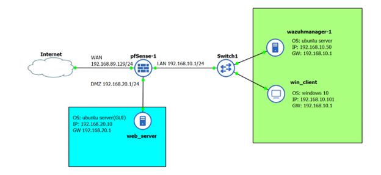

# Lab Architecture

## 1. Overview

This project implements a small-scale Security Information and Event Management (SIEM) lab using Wazuh.

The lab is designed to demonstrate how endpoint security logs can be collected, forwarded to a centralized SIEM platform, analyzed, and presented as security alerts.

The environment also includes a controlled attacker machine to generate security events against a monitored web server.

The main components are:

- pfSense firewall
- Ubuntu Web Server
- Wazuh Manager
- Wazuh Agent
- Wazuh Indexer
- Wazuh Dashboard
- Kali Linux attacker

---

## 2. Network Topology

The laboratory environment consists of separate network segments connected through pfSense.

```text
                         ┌─────────────────────┐
                         │     Kali Linux      │
                         │      Attacker       │
                         │   192.168.10.20     │
                         └──────────┬──────────┘
                                    │
                                    │ Attack Traffic
                                    ▼
                         ┌─────────────────────┐
                         │       pfSense       │
                         │       Firewall      │
                         └──────────┬──────────┘
                                    │
                       ┌────────────┴────────────┐
                       │                         │
                       ▼                         ▼
             ┌──────────────────┐      ┌──────────────────┐
             │   Web Server     │      │  Wazuh Manager   │
             │     Ubuntu       │      │     + Indexer    │
             │  192.168.20.10   │      │  192.168.10.50   │
             │                  │      │                  │
             │ Apache /         │      │ Wazuh Dashboard  │
             │ WordPress        │      │                  │
             │                  │      └──────────────────┘
             │ Wazuh Agent      │
             └────────┬─────────┘
                      │
                      │ Security Logs
                      │
                      └──────────────────────►
                              Wazuh Manager
```

> IP addresses shown above represent the laboratory environment and are used for demonstration purposes.

---

## 3. Network Segmentation

The lab uses VMware virtual networks to separate different parts of the environment.

| Network | Purpose |
|---|---|
| `vmnet8` | WAN / NAT connectivity |
| `vmnet1` | LAN / internal network |
| `vmnet2` | DMZ / isolated server network |

The main internal systems include:

| System | IP Address | Role |
|---|---|---|
| pfSense LAN | `192.168.10.1` | Internal gateway |
| Wazuh Manager | `192.168.10.50` | SIEM management and analysis |
| Web Server | `192.168.20.10` | Monitored web server |
| Windows Client | `192.168.10.101` | Client endpoint |
| Kali Linux | `192.168.10.20` | Security testing / attacker |

The Web Server is located in the DMZ network and uses pfSense as its default gateway.

---

## 4. Component Roles

### 4.1 pfSense

pfSense acts as the network firewall and gateway for the laboratory.

Its main responsibilities include:

- Routing between network segments
- Controlling traffic between LAN and DMZ
- Providing network isolation
- Controlling access to the monitored web server
- Supporting the controlled attack-testing environment

pfSense provides the network boundary between the attacker, internal systems, and the monitored server.

---

### 4.2 Ubuntu Web Server

The Ubuntu server is the primary monitored endpoint in the lab.

It runs:

- Apache2
- WordPress
- MySQL
- PHP
- Wazuh Agent

The web server generates application and system logs that are collected by the Wazuh Agent.

The server is also the target of the controlled Nikto and Hydra attack simulations.

---

### 4.3 Wazuh Agent

The Wazuh Agent is installed on the Ubuntu Web Server.

Its main purpose is to collect relevant endpoint and application security information and forward it to the Wazuh Manager.

The monitoring flow is:

```text
Ubuntu Web Server
       │
       │ Logs / Security Events
       ▼
 Wazuh Agent
       │
       │
       ▼
 Wazuh Manager
```

The agent status is verified through the Wazuh Dashboard before performing attack simulations.

---

### 4.4 Wazuh Manager

The Wazuh Manager is the central security monitoring component of the lab.

It is responsible for:

- Receiving events from Wazuh Agents
- Analyzing collected security events
- Applying detection rules
- Generating security alerts
- Forwarding information to the Wazuh Indexer

The Wazuh Manager is deployed together with the Wazuh Indexer and Dashboard in the laboratory environment.

---

### 4.5 Wazuh Indexer

The Wazuh Indexer stores and indexes security events generated by the Wazuh monitoring environment.

This allows security events to be searched and visualized through the Wazuh Dashboard.

The simplified data flow is:

```text
Wazuh Agent
     │
     ▼
Wazuh Manager
     │
     ▼
Wazuh Indexer
     │
     ▼
Wazuh Dashboard
```

---

### 4.6 Wazuh Dashboard

The Wazuh Dashboard provides the interface used to monitor the environment.

It is used to:

- Check agent status
- Review security events
- Investigate alerts
- Examine detection rule information
- Analyze events generated during attack simulations

The dashboard provides the main interface for validating the SIEM monitoring workflow.

---

### 4.7 Kali Linux

Kali Linux is used as the controlled attacker machine.

It generates security testing traffic against the monitored Web Server.

The main tools used in this project are:

- Nikto
- Hydra

These tools are used only within the controlled laboratory environment to validate Wazuh detection capabilities.

---

## 5. Security Monitoring Flow

The overall monitoring workflow is:

```text
┌──────────────────┐
│ Kali Linux       │
│ Attack Simulation│
└────────┬─────────┘
         │
         │ HTTP Requests
         │
         ▼
┌──────────────────┐
│ Ubuntu Web Server│
│ Apache / WordPress│
└────────┬─────────┘
         │
         │ Logs
         ▼
┌──────────────────┐
│ Wazuh Agent      │
└────────┬─────────┘
         │
         │ Security Events
         ▼
┌──────────────────┐
│ Wazuh Manager    │
│ Detection Rules  │
└────────┬─────────┘
         │
         ▼
┌──────────────────┐
│ Wazuh Indexer    │
└────────┬─────────┘
         │
         ▼
┌──────────────────┐
│ Wazuh Dashboard  │
│ Security Alerts  │
└──────────────────┘
```

This architecture demonstrates the basic SOC monitoring workflow:

**Attack → Log Generation → Log Collection → Event Analysis → Alert → Investigation**

---

## 6. Attack and Detection Architecture

Two controlled attack scenarios are used to validate the monitoring pipeline.

### 6.1 Web Scanning

Nikto is used to perform web server reconnaissance and scanning against the Ubuntu Web Server.

The detection flow is:

```text
Kali Linux
    │
    │ Nikto Scan
    ▼
Web Server
    │
    │ Apache Logs
    ▼
Wazuh Agent
    │
    ▼
Wazuh Manager
    │
    │ Rule 31101
    ▼
Security Alert
```

The Wazuh environment detects abnormal HTTP GET activity generated during the scan.

---

### 6.2 Web Login Brute Force

Hydra is used to simulate repeated login attempts against the WordPress login endpoint.

The detection flow is:

```text
Kali Linux
    │
    │ Hydra
    ▼
/wp-login.php
    │
    │ HTTP POST Requests
    ▼
Web Server
    │
    ▼
Wazuh Agent
    │
    ▼
Wazuh Manager
    │
    │ Rule 40501
    ▼
High-Level Security Alert
```

The repeated HTTP POST requests generated by the brute-force simulation are detected by Wazuh.

---

## 7. Monitoring Architecture Summary

The architecture separates the environment into three main functional areas.

### Attack Source

```text
Kali Linux
```

Used to generate controlled security events.

### Monitored Endpoint

```text
Ubuntu Web Server
├── Apache
├── WordPress
├── MySQL
├── PHP
└── Wazuh Agent
```

Generates application and system events.

### SIEM Infrastructure

```text
Wazuh Manager
      │
      ├── Wazuh Indexer
      │
      └── Wazuh Dashboard
```

Collects, analyzes, stores, and visualizes security events.

The complete architecture demonstrates how endpoint telemetry can be transformed into actionable security alerts in a small SOC-style monitoring environment.

---

## 8. Architecture Diagram

The corresponding architecture diagram is available below:



---

## 9. Design Objective

The primary objective of this architecture is to demonstrate a practical security monitoring pipeline rather than a production-scale SIEM deployment.

The lab focuses on:

- Centralized security monitoring
- Endpoint log collection
- Network segmentation
- Security event analysis
- Attack detection
- Alert investigation
- Basic SOC workflow validation

All attack activities are performed in a controlled laboratory environment.
